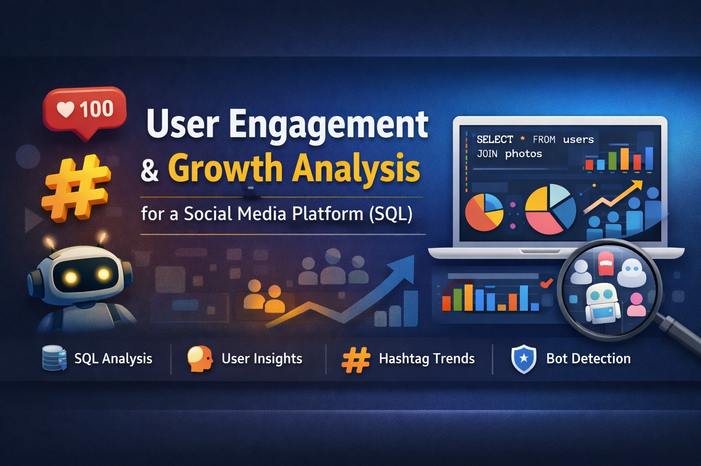

# Advanced_SQL_for_User_Engagement_SocialMedia

## Project Overview

This project analyzes Instagram-like user data using SQL to derive actionable insights for marketing teams and investors. 

The analysis focuses on user engagement, growth patterns, content performance, and detection of bot-like behavior using advanced SQL querying techniques.

This project showcases advanced SQL for real-world analytics, combining data quality checks, engagement metrics, behavioral segmentation, and business-driven insights in a structured, production-style approach.

## Dataset Overview

Relational database containing the following tables:

users – user profiles and registration dates

photos – user-posted content

likes – user interactions with photos

tags, photo_tags – hashtag metadata

## SQL Concepts Used

This project demonstrates industry-relevant SQL skills, including:

Filtering & Conditions: WHERE, CASE WHEN

Sorting & Limiting: ORDER BY, LIMIT

Aggregations: COUNT(), ROUND()

Joins: INNER JOIN, LEFT JOIN, CROSS JOIN

Grouping & Segmentation: GROUP BY, HAVING

Subqueries & CTEs: WITH clauses

Date Functions: DAYNAME(), DATE_FORMAT()

Null Handling: IFNULL()

## Key Insights & How They Were Derived

### 1. Loyal & High-Value Users

- SQL Used: LEFT JOIN, COUNT, ORDER BY

- Identified long-tenured users with consistent posting activity

- Helps marketing teams design loyalty rewards

### 2. Inactive Users (Never Posted)

- SQL Used: LEFT JOIN, WHERE IS NULL

- ~26% of users have never posted content

- Indicates onboarding or engagement friction

### 3. User Engagement Distribution

- SQL Used: CASE WHEN, GROUP BY

- Users segmented into inactive, low, medium, and high activity groups

- Reveals that engagement is driven by a small group of power users

### 4. Most Liked Photo (Content Performance)

- SQL Used: INNER JOIN, GROUP BY, ORDER BY

- Identified the photo with the highest engagement

- Useful for content and campaign strategy

### 5. Hashtag Effectiveness

- SQL Used: JOIN, COUNT(DISTINCT)

- Ranked hashtags based on engagement, not just usage

- Enables data-driven hashtag strategy

### 6. Best Day to Launch Ad Campaigns

- SQL Used: DAYNAME(), GROUP BY

- Thursday and Sunday show highest user registrations

- Helps optimize ad timing

### 7. Platform Engagement Metrics

- SQL Used: Subqueries, aggregation

- Average posts per active user

- Ratio of total posts to total users

- Indicates overall platform health

### 8. Bot / Fake Account Detection

- SQL Used: CTEs, HAVING, conditional logic

- Identified users who like almost all photos but never post

- ~13% of accounts show bot-like behavior

## Important investor trust metric

### Business Impact

- Improves targeting for marketing campaigns

- Identifies engagement and retention gaps

- Enhances platform credibility through bot detection

## Tech Stack

- Database: MySQL

- Query Execution: MySQL Workbench 

- Language: SQL

